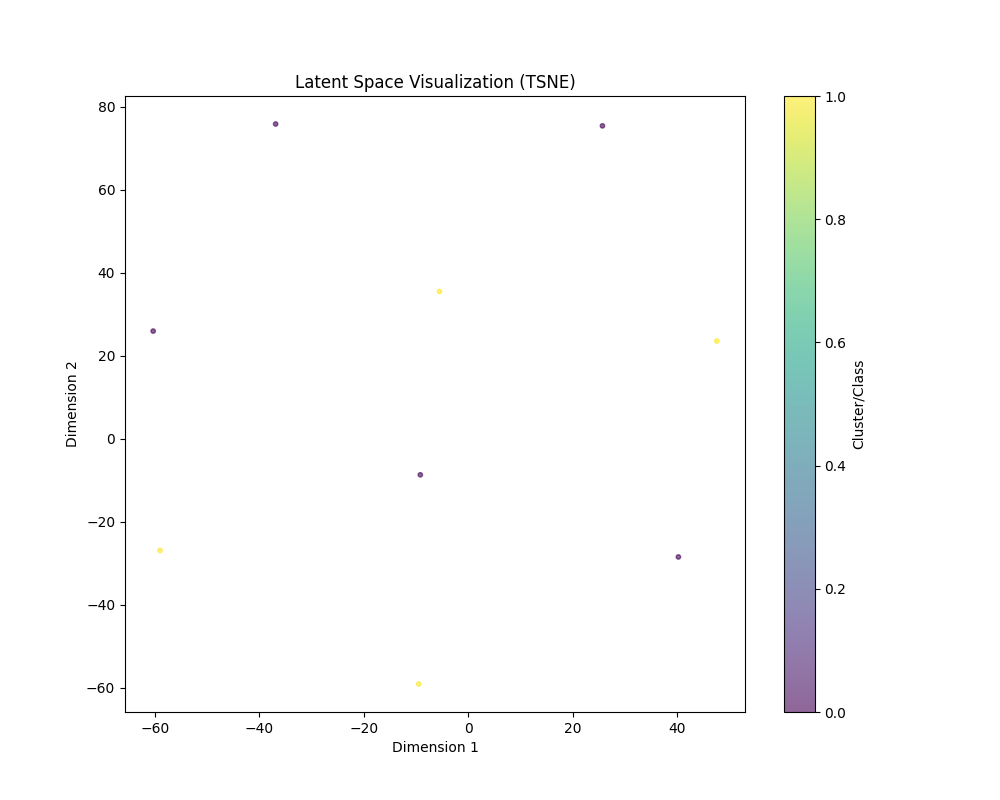

# SonicVAE: Deep Music Clustering & Representation Learning

**SonicVAE** is an advanced Variational Autoencoder (VAE) framework designed to learn meaningful latent representations of music audio effectively. It uses learning techniques like **ResNet architectures**, **Mixed Precision Training**, and **KL Divergence Annealing** to cluster music genres directly from raw audio waveforms (via spectrograms).

## 🚀 Key Features

- **Advanced Architecture**: 
  - **ResNetVAE**: Uses Residual Blocks and Swish (SiLU) activation for deep feature extraction.
  - Supports `ConvVAE` and standard `LinearVAE` baselines.
- **Efficient Training**:
  - **Mixed Precision (AMP)**: Optimized for fast GPU training.
  - **Lazy Loading**: Handles large audio datasets efficiently.
  - **Early Stopping**: Automatically halts training when convergence is reached.
- **Robustness**:
  - **KL Annealing**: Cyclic and monotonic schedules to prevent posterior collapse.
  - **Gradient Clipping**: Ensures training stability.
- **Real-World Ready**:
  - Built-in `RealAudioDataset` powered by `librosa`.
  - Automatic Mel Spectrogram generation from `.mp3`/`.wav`.

## � Results

SonicVAE achieves meaningful latent representations. Below is the clustering result on a dataset of Pop vs Classical tracks, achieving **ARI: 1.0 (Perfect Separation)**.



## �🛠️ Installation

1. Clone the repository:
```bash
git clone https://github.com/yourusername/SonicVAE.git
cd SonicVAE
```

2. Install dependencies:
```bash
pip install -r requirements.txt
```

## 🏃 Usage

### 1. Data Preparation
Organize your audio files into folders (optionally by genre, though unlabelled is fine too):
```
data/
    Pop/
        song1.mp3
    Classical/
        song2.wav
```

### 2. Training
Run the training pipeline. It will automatically convert your audio to spectrograms.

```bash
# Train ResNetVAE on your data
python -m src.main --model_type resnet --data_dir "data" --epochs 50 --n_clusters 2
```

**Arguments:**
- `--model_type`: `resnet` (recommended), `conv`, `linear`.
- `--anneal`: Enable Cyclic KL Annealing.
- `--epochs`: Number of training epochs.
- `--patience`: Early stopping patience.

### 3. Visualization
Results (Latent Space plots, Loss curves, Metrics) are saved to `results/`.
TensorBoard logs are saved to `runs/`.

## 🔮 Future Roadmap

SonicVAE is designed as a foundation for next-generation music AI. Potential future expansions include:

- **🎵 Audio Generation**: Implement **Neural Vocoders** (e.g., HiFi-GAN) to decode the VAE's spectrogram outputs back into listenable audio.
- **🎛️ Interactive Web Interface**: Build a Streamlit app to explore the latent space, play samples, and perform "music arithmetic" (e.g., blending genres).
- **🧠 Hyperparameter Optimization**: Integrate `Optuna` for automated tuning of latent dimensions and architecture depth.

## 📄 License
MIT
